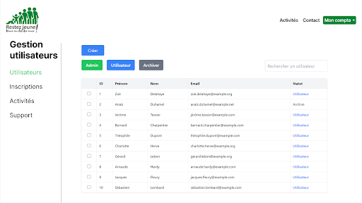
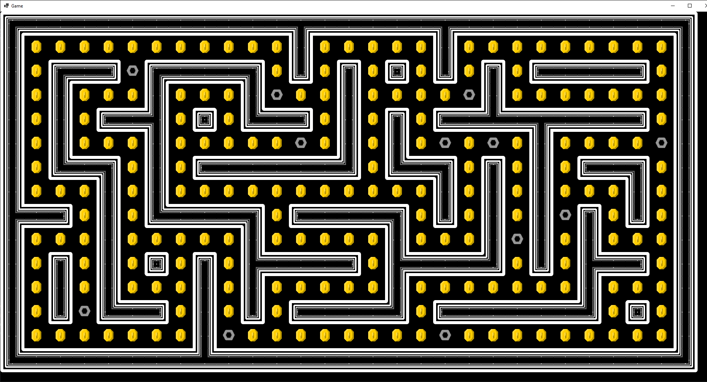

# Raphaël Pocholle

## Étudiant en BUT Informatique — Développeur web en devenir

Passionné par le **développement web**, je suis actuellement en deuxième année de BUT Informatique à l’IUT d’Amiens.  
Curieux, rigoureux et autonome, je prends plaisir à travailler sur des projets concrets, en particulier lorsqu’ils impliquent la création d’interfaces web dynamiques et la mise en place de solutions fonctionnelles côté serveur.

---

## Parcours académique

**2023 – 2025**  
**BUT Informatique** – IUT d’Amiens

**2022 – 2023**  
**Prépa intégrée** – Université de Technologie de Belfort-Montbéliard (UTBM)

**2019 – 2022**  
**Bac Général** – Spécialités Mathématiques & Sciences de l’Ingénieur  
Lycée Édouard Branly, Amiens

---

## Compétences

### Développement

- **Front-end :** HTML, CSS, JavaScript, Bootstrap, Tailwind, C# (interface graphique)
- **Back-end :** PHP (Laravel), Python, C, C++, C#
- **Bases de données :** MySQL
- **Systèmes :** Bash, Unix

### Savoirs-faire

- Conception et développement d’applications web
- Optimisation de code et de performances
- Administration de systèmes communicants
- Manipulation et structuration des données
- Gestion de projets (méthodes agiles, cycle en V)
- Collaboration en équipe, utilisation de Git

---

## Projets réalisés & expériences

### Stage ouvrier – Schlumberger (Abbeville)
**Janvier – Février 2023**  
Découverte du fonctionnement industriel d’un grand groupe technologique, intégration dans une équipe technique.

### Stage de développement – Club des Aînés (Longpré-les-Corps-Saints)
**Janvier – Mars 2025**  
Conception et réalisation d’un **site vitrine** : design, intégration responsive, mise en place d’un back-end avec **PHP (Laravel)**.

### Pacbot – Projet jeu en C
Jeu inspiré de Pacman avec IA ennemie, gestion de collisions, pouvoirs bonus.  
Projet développé dans le cadre d’une SAÉ avec gestion d’équipes.

### Site Gérico – Application web complète
Projet réalisé pour un client réel :  
- Front-end en **Tailwind, HTML, JS**  
- Back-end en **Laravel**  
- Travail en équipe avec versionnage Git et sprints agiles

### Gestion de membres – Application en C
Application en ligne de commande pour la gestion de fichiers membres :  
tri, recherche, insertion, suppression, avec une logique basée sur des structures de données adaptées.

---

## Ce que m’apporte le BUT

Le BUT m’a permis de :
- Approfondir mes compétences techniques et pratiques
- Travailler sur des projets concrets avec une vraie méthodologie de production
- Gagner en autonomie, en organisation et en esprit d’équipe

**Objectif :** poursuivre vers une école d’ingénieur ou un master spécialisé en développement web ou architecture logicielle.

---

## Contact

**Téléphone :** +33 6 65 22 87 63  
**Email :** raphael.pchl@gmail.com  
**Linkedin :** https://www.linkedin.com/in/raphael-pocholle-bb61b4342/ 
